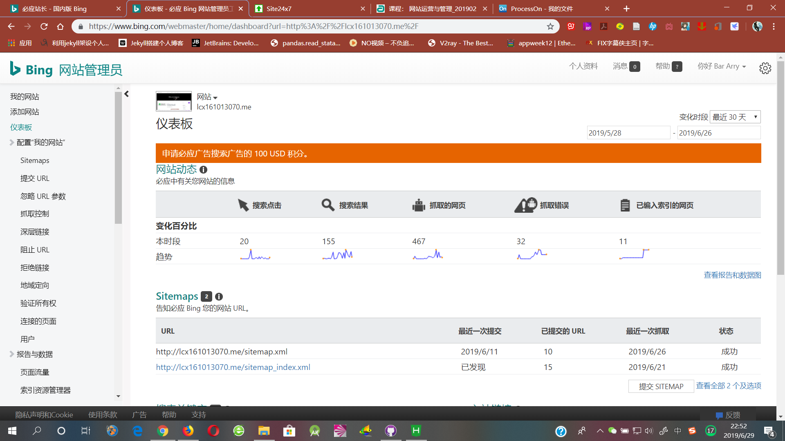

# - 期末报告

项目 | 名称
--- | --- |
姓名 | 罗昶熙
学号 | 161013070
website | http://lcx161013070.me/

## 1.策划
### 1.1 网站建设目标
* a.确定明确主题：本网站致力于分享、推广美漫文化，并且以美国DC漫画公司的内容、漫改影视中的小丑这一角色为主，并且也会分享一些建站时的经验文章，促进学习兴趣爱好两不误；
* b.本站会选择与内容主题相匹配的网站外观主题及调整布局使其合理
* c.本站及时更新内容文章，尽量做到有规律的更新，避免流量流失，并且在文章内容上要迎合主要的目标用户

### 1.2 目标用户画像
用户角色 | 使用场景 | 问题需求 | 
---|---|---|
15-30岁的美漫爱好者&小丑角色爱好者 | 1.想了解最新的与小丑有关的漫画\影视资讯   2.想通过查找分析文章了解、解读一些关于小丑的漫画\影视内容及问题分析 | 需要一个客观的、专注于分享推广小丑这一漫画角色的博客网站进行信息获取、解读
初次建站的美漫爱好者 | 想要进行个人建站 | 想要进行个人建站却被一些“基本操作”挡在门外
对美漫（尤其是小丑这个角色）种草的用户 | 1.想要了解美漫及其文化   2.想要具体了解小丑这个角色 | 需要一个对美漫及小丑这个角色有一定分析及推广的文章的博客网站进行信息获取

### 1.3 网站规划
* 1.网站的非更新性内容：联系页面、导航栏、网站标题
* 2.网站的更新性内容：My Blog(初识WP、My SEO、踩坑)、DC Comic
* 3.基于用户调研&访谈，使用DVF模型定义需求——与网站前期规划相比，对网站的整体布局需要再合理化。同时应更明确网站的内容主题，借此吸引用户
* 

### 1.4 需求定义

### 1.5 网站地图
* 

### 1.6 平面设计插件运用
* [Animate it!](http://lcx161013070.me/) 
* * 在侧边栏使用了三个动画效果

* [SiteOrigin1](http://lcx161013070.me/dc-comic/)
	* * 使用了siteorigin editor、siteorigin image、post carousel，制作出简易页面的效果，并且使用posts carousel让文章以较简洁的形式展现出来
* [SiteOrigin2](http://lcx161013070.me/only-me/)
	* * 使用了siteorigin headline、siteorigin editor、siteorigin contact form，制作出联系表单的效果，可以一目了然进行填写表单联系
* [SiteOrigin3](http://lcx161013070.me/category/uncategorized/)
	* * 使用了FooGallery插件，插入标题中，制作画廊效果
* [SiteOrigin4](http://lcx161013070.me/my-blog/)
	* * 使用了siteorigin editor、siteorigin image、post grid，由于此页面文章归类较多，因此使用了posts grid，可以一次性显示更多的文章却又不是简洁

### 1.7 平面设计
* 网站配色、对比度与可读性
* * 本站采用了紫色与黑色、白色这三种色调进行搭配，源于内容主题，小丑这一漫画角色的配色，并且背景图片为被誉为“最伟大的小丑”的扮演者希斯·莱杰的插画，突出主题，并且与白色的网站界面相对比
* * 

* 图片的使用
* * 本网站图片的主要来源："DC漫画"公众号("DCmanhua")、老师教学文档截图、个人截图
	* * 页面"my seo"&"踩坑"所用到的foogallery：
		* * [图片来源1](https://searchengineland.com/figz/wp-content/seloads/2018/02/bing-teal-logo-wordmark3-1920.png)   [图片来源2](https://image.baidu.com/search/detail?ct=503316480&z=0&ipn=d&word=%E8%B8%A9%E5%9D%91&hs=2&pn=0&spn=0&di=172260&pi=0&rn=1&tn=baiduimagedetail&is=0%2C0&ie=utf-8&oe=utf-8&cl=2&lm=-1&cs=2211723556%2C4285150777&os=1229686684%2C3318491350&simid=0%2C0&adpicid=0&lpn=0&ln=30&fr=ala&fm=&sme=&cg=&bdtype=0&oriquery=%E8%B8%A9%E5%9D%91&objurl=http%3A%2F%2Fe0.ifengimg.com%2F07%2F2018%2F1203%2F0B81F0A6D281873B4C929FC0CDBB3E7322B9D13E_size36_w535_h300.jpeg&fromurl=ippr_z2C%24qAzdH3FAzdH3Foj4j1tw_z%26e3Btujg2_z%26e3Bv54AzdH3Fl88cd800AzdH3Foj4j1tw_z%26e3Bfip4s&gsm=0&islist=&querylist=)
	* * 《DC漫画史——小丑》：[图片来源](https://mp.weixin.qq.com/s/eLq9Wq6qrNTE0nb2mFnRZQ)
	* * 《DC电影史——一位小丑永远留在我们心里……》：[图片来源](https://mp.weixin.qq.com/s/tQ4ArNg3R5uJaGYdB3hK-w)
	* * 《DC影视——谁才是小丑之王》：[图片来源](https://mp.weixin.qq.com/s/yYlmZMo7vMBwFExpKyJGUw)
	* * 《DO搭建WP》：[图片来源](http://lcx161013070.me/wp-content/uploads/2019/06/digitalocean%E6%90%AD%E5%BB%BAwp.docx)
	* * 《namecheap注册域名并用DO绑定》：[图片来源](http://lcx161013070.me/wp-content/uploads/2019/06/namecheap%E6%B3%A8%E5%86%8Cdigital%E7%BB%91%E5%AE%9A%E5%9F%9F%E5%90%8D.docx)
	* * 三篇站长认证文及踩坑文均为原创文章，[部分图片来源于网络](https://www.laozuo.org/5751.html),其余图片均为网站拥有者个人截图

* 图库风格及配色
* * 风格：采用黑暗风格——通过对多年美漫的了解以及和用户调研，基本可以确定爱好者及普通人对于美漫的初步认识都是偏黑暗风格，因此采用一些网上的黑暗风美漫插画图会比较符合主题
* * 配色：黑色、紫色，黑色为美漫常用的风格基调色，紫色为小丑这一角色的主题色，搭配在一起更易突出主题
* * 部分图片展示：
* * 

### 1.8 3篇云端架站踩坑图文
* [那些年踩过的坑——DO账号的锁定](http://lcx161013070.me/2019/06/29/%e9%82%a3%e4%ba%9b%e5%b9%b4%e8%b8%a9%e8%bf%87%e7%9a%84%e5%9d%91-do%e8%b4%a6%e5%8f%b7%e7%9a%84%e9%94%81%e5%ae%9a/)
* [那些年踩过的坑2——关于github绑定namecheap域名](http://lcx161013070.me/2019/06/30/%e9%82%a3%e4%ba%9b%e5%b9%b4%e8%b8%a9%e8%bf%87%e7%9a%84%e5%9d%912-%e5%85%b3%e4%ba%8egithub%e7%bb%91%e5%ae%9anamecheap%e5%9f%9f%e5%90%8d/)
* [那些年踩过的坑3——除了seo认证&sitemap，还能怎样令网站搜索排名靠前?](http://lcx161013070.me/2019/06/30/%e9%82%a3%e4%ba%9b%e5%b9%b4%e8%b8%a9%e8%bf%87%e7%9a%84%e5%9d%913-%e9%99%a4%e4%ba%86seo%e8%ae%a4%e8%af%81sitemap%ef%bc%8c%e8%bf%98%e8%83%bd%e6%80%8e%e6%a0%b7%e4%bb%a4%e7%bd%91/)

## 2.管理
### 2.1 云端架站
* [Study's Joker(http://lcx161013070.me/)](http://lcx161013070.me/)

### 2.2 网站安全
* 使用了Wordfence
*  
* 
* * 
* 
* 由上图可知，本网站安全系数高，浏览记录登记均为本人（外国国旗为SSR时登录的记录）暂无发现恶意攻击本网站的行为   同时可知防火墙正在不断的学习中，从中提供网站的安全性

### 2.3 网站性能
*  
*  
*  
* a.由上图可知，已添加了8座城市（5个国内3个国外），都为亚太地区的城市，借此来看看我们国家附近的地区的情况；   b.从图中可以可以看出，网站对于站长自己的所在地广州一点都不友好，还发生了停机，而对于国内其他城市，北京和深圳也发生了停机，由此可知网站对于国内的访问还是相对不够友好的；   c.对于国外的三个城市，网站的情况还算不错，暂时没有出现停机。

### 2.4 网站备份
* 利用winSCCP对php文件进行备份
* *  

* 利用插件WPDB对数据库sql文件进行备份
* *  

* 利用wp后台文件导出进行备份
* *  

* 最后是备份结果(图中文字解释打错，应为WPDB插件)
* *  

## 3.运营
### 3.1 站长工具
* 必应站长认证
* *  
* *  

* 谷歌站长认证
* * 

### 3.2 SEO优化

### 3.4 用户研究
* 用户访谈/焦点小组（5人）
* A/B测试

### 3.5 定制化
* 方案①
* 方案②